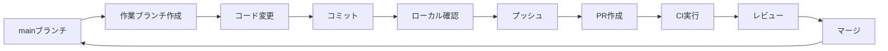

# コントリビューションガイド

このドキュメントは、Pokemon Bartle Type Quiz Gameプロジェクトへの貢献方法を説明します。

## 📋 目次
- [開発フロー](#開発フロー)
- [ブランチ命名規則](#ブランチ命名規則)
- [コミットメッセージ規約](#コミットメッセージ規約)
- [Issue運用](#issue運用)
- [Pull Request規約](#pull-request規約)
- [コーディング規約](#コーディング規約)

---

## 🔄 開発フロー



### 基本的な流れ

1. **最新のmainブランチを取得**
   ```bash
   git checkout main
   git pull origin main
   ```

2. **作業ブランチを作成**
   ```bash
   git checkout -b <type>/<description>
   ```

3. **コード変更とコミット**
   ```bash
   git add .
   git commit -m "<type>: <description>"
   ```

4. **ローカルサーバーで動作確認（必須）**
   ```bash
   npm run start
   ```
   - ブラウザで http://localhost:4200 を開く
   - 変更した機能が正しく動作することを確認
   - **UI/スタイル変更の場合は必ずスクリーンショットを撮影**して記録
   - デスクトップ/モバイル両方で確認
   - エラーが発生した場合はエラーメッセージを確認し解決

5. **一時ファイルの管理**
   - PR作成用の一時ファイル（`pr-body.md`等）がある場合、ブランチ切り替え前に `git stash` で退避
   ```bash
   git stash              # 一時ファイルを退避
   git checkout main      # ブランチ切り替え
   git stash pop          # 必要に応じて復元
   ```

6. **プッシュとPR作成**
   ```bash
   git push -u origin <branch-name>
   # GitHubでPRを作成
   ```


---

## 🌿 ブランチ命名規則

### フォーマット
```
<type>/<short-description>
```

### タイプ一覧

| タイプ | 用途 | 例 |
|--------|------|-----|
| `feature/` | 新機能開発 | `feature/add-sound-effects` |
| `fix/` | バグ修正 | `fix/button-alignment-issue` |
| `hotfix/` | 緊急バグ修正 | `hotfix/critical-crash-fix` |
| `refactor/` | リファクタリング | `refactor/simplify-game-logic` |
| `docs/` | ドキュメント更新 | `docs/update-readme` |
| `test/` | テスト追加・修正 | `test/add-game-component-tests` |
| `chore/` | 雑務（依存関係更新等） | `chore/update-dependencies` |
| `style/` | スタイル・デザイン変更 | `style/update-button-colors` |
| `perf/` | パフォーマンス改善 | `perf/optimize-image-loading` |
| `ci/` | CI/CD設定変更 | `ci/add-github-actions` |

### 命名ルール
- **小文字とハイフン**を使用: `feature/add-new-feature` ✅
- **キャメルケースは使わない**: `feature/addNewFeature` ❌
- **スペースは使わない**: `feature/add new feature` ❌
- **簡潔で分かりやすく**: 3〜5単語程度

### 例
```bash
✅ feature/pokemon-type-filter
✅ fix/history-display-bug
✅ refactor/design-system-tokens
✅ docs/add-contributing-guide
❌ feature/AddPokemonTypeFilter
❌ fix-bug
❌ my-branch
```

---

## 💬 コミットメッセージ規約

### フォーマット（Conventional Commits）
```
<type>: <description>

[optional body]

[optional footer]
```

### タイプ一覧

| タイプ | 用途 | 例 |
|--------|------|-----|
| `feat` | 新機能の追加 | `feat: add sound toggle switch` |
| `fix` | バグ修正 | `fix: resolve history display issue` |
| `docs` | ドキュメントのみの変更 | `docs: update README with setup instructions` |
| `style` | コードの意味に影響しない変更 | `style: format code with prettier` |
| `refactor` | バグ修正や機能追加を伴わない改善 | `refactor: simplify game logic` |
| `perf` | パフォーマンス改善 | `perf: optimize image loading` |
| `test` | テストの追加・修正 | `test: add unit tests for game service` |
| `build` | ビルドシステムや依存関係の変更 | `build: update Angular to v18` |
| `ci` | CI設定の変更 | `ci: add ESLint to GitHub Actions` |
| `chore` | その他の変更 | `chore: update dependencies` |
| `revert` | 以前のコミットを取り消す | `revert: revert "feat: add feature X"` |

### ルール
- **小文字で始める**: `feat: add feature` ✅
- **大文字で始めない**: `Feat: Add feature` ❌
- **ピリオドで終わらない**: `feat: add feature.` ❌
- **現在形を使う**: `feat: add` ✅ / `feat: added` ❌
- **50文字以内**: 簡潔に

### 例
```bash
✅ feat: add Pokemon type filter to game
✅ fix: resolve button alignment issue in header
✅ refactor: extract design tokens to separate files
✅ docs: add contribution guidelines
❌ Added new feature
❌ fix bug
❌ Update files
```

---

## 📋 Issue運用

### Issueを立てるタイミング

以下のような場合にIssueを作成します:

- 🐛 **バグ報告**: 動作に問題がある
- ✨ **機能リクエスト**: 新しい機能を追加したい
- 📝 **タスク管理**: 大きな作業を分割して管理
- 💭 **将来の改善**: 今すぐ対応しないが記録しておくべき内容

### Issueラベルの使い方

| ラベル | 用途 | 例 |
|--------|------|-----|
| `feat` | 新機能 | 新しいゲームモードの追加 |
| `fix` | バグ修正 | 表示崩れの修正 |
| `docs` | ドキュメント | README更新 |
| `style` | UI/デザイン変更 | ボタンの見た目改善 |
| `refactor` | リファクタリング | コードの整理 |
| `perf` | パフォーマンス改善 | 読み込み速度改善 |
| `test` | テスト | テストコード追加 |
| `build` | ビルド関連 | webpack設定変更 |
| `ci` | CI/CD | GitHub Actions設定 |
| `chore` | その他 | 依存関係更新 |

### 関連Issueの記載方法（PRで使用）

PRで関連Issueを記載する際は、以下のキーワードを使用:

| キーワード | 用途 | 例 |
|-----------|-----|-----|
| `Closes #XX` | このPRでIssueを**解決**する | `Closes #17` |
| `Fixes #XX` | バグ修正でIssueを解決する | `Fixes #19` |
| `Related to #XX` | 関連はあるが解決しない | `Related to #19` |
| `See #XX` | 参考情報として関連 | `See #18` |

**注意**: `Closes`や`Fixes`を使うと、PRマージ時に自動でIssueがクローズされます。

### Issueテンプレート

Issueを作成する際は、適切なテンプレートを選択してください:
- `.github/ISSUE_TEMPLATE/feature_request.md` - 新機能リクエスト
- `.github/ISSUE_TEMPLATE/bug_report.md` - バグ報告
- `.github/ISSUE_TEMPLATE/task.md` - 一般的なタスク

---

## 📝 Pull Request規約

### PRタイトル

コミットメッセージと同じ規約を使用:
```
<type>: <description>
```

**例**:
```
✅ feat: add sound effects and toggle switch
✅ fix: resolve history display bug
✅ ci: add comprehensive CI/CD pipeline
❌ Add new feature
❌ Fix bug
❌ Update
```

### PR説明

PRテンプレート（`.github/PULL_REQUEST_TEMPLATE.md`）に従って記載:

1. **概要**: 何を実現するか
2. **変更内容**: 主な変更点のリスト
3. **関連Issue**: 該当する場合（[Issue運用](#issue運用) 参照）
4. **スクリーンショット**: UI変更がある場合
5. **チェックリスト**: 必須項目の確認

### レビュー

- **すべてのCIチェックが通過**していることを確認
- **コンフリクトを解消**してから依頼
- **レビューコメントには必ず返信**する

---

## 🎨 コーディング規約

### Angular

- **Standalone Components**を使用
- **Signals**を使用して状態管理
- **OnPush Change Detection**を推奨

### TypeScript

- **厳格な型定義**を使用
- `any`型は避ける
- **明示的な型注釈**を推奨

### スタイル

- **デザインシステムのトークン**を使用
- **Tailwind CSSのユーティリティクラス**は禁止（デザインシステムのトークンを使用）
- **SCSSでコンポーネントスタイル**を定義

### 命名規則

- **ファイル名**: `kebab-case.component.ts`
- **クラス名**: `PascalCase`
- **変数・関数**: `camelCase`
- **定数**: `UPPER_SNAKE_CASE`

---

## 🤖 AI開発者向けガイド

このセクションは、AIアシスタント（GitHub Copilot、Claude、ChatGPTなど）が自動で読み取り、開発ルールに従うためのものです。

### 必須ルール

1. **ブランチ作成時**:
   - 必ず`<type>/<description>`形式を使用
   - タイプは上記の表から選択
   - 説明は小文字とハイフンのみ

2. **コミット時**:
   - 必ず`<type>: <description>`形式を使用
   - タイプは上記の表から選択
   - 現在形、小文字、50文字以内

3. **PR作成時**:
   - タイトルはコミットメッセージと同じ形式
   - テンプレートに従って説明を記載
   - チェックリストをすべて確認

4. **コード変更時**:
   - デザインシステムのトークンを使用
   - ESLintエラーを解消
   - ビルドが成功することを確認

### 自動チェック

以下は自動でチェックされます:
- ✅ ビルド成功（GitHub Actions）
- ✅ Lintエラーなし（GitHub Actions）
- ✅ テスト成功（GitHub Actions）
- ✅ ブランチ名形式（今後追加予定）
- ✅ PRタイトル形式（今後追加予定）

---


---

## 📚 参考資料
**Happy Coding! 🚀**
```
