# コントリビューションガイド

このドキュメントは、Pokemon Bartle Type Quiz Gameプロジェクトへの貢献方法を説明します。

## 📋 目次
- [開発フロー](#開発フロー)
- [ブランチ命名規則](#ブランチ命名規則)
- [コミットメッセージ規約](#コミットメッセージ規約)
- [Pull Request規約](#pull-request規約)
- [コーディング規約](#コーディング規約)

---

## 🔄 開発フロー

```mermaid
graph LR
    A[mainブランチ] --> B[作業ブランチ作成]
    B --> C[コード変更]
    C --> D[コミット]
    D --> E[プッシュ]
    E --> F[PR作成]
    F --> G[CI実行]
    G --> H[レビュー]
    H --> I[マージ]
    I --> A
```



### 基本的な流れ

1. **最新のmainブランチを取得**
   ```bash
   git checkout main
   git pull origin main
   ```

2. **作業ブランチを作成**
   ```bash
   git checkout -b <type>/<description>
   ```

3. **コード変更とコミット**
   ```bash
   git add .
   git commit -m "<type>: <description>"
   ```

4. **プッシュとPR作成**
   ```bash
   git push -u origin <branch-name>
   # GitHubでPRを作成
   ```

---

## 🌿 ブランチ命名規則

### フォーマット
```
<type>/<short-description>
```

### タイプ一覧

| タイプ | 用途 | 例 |
|--------|------|-----|
| `feature/` | 新機能開発 | `feature/add-sound-effects` |
| `fix/` | バグ修正 | `fix/button-alignment-issue` |
| `hotfix/` | 緊急バグ修正 | `hotfix/critical-crash-fix` |
| `refactor/` | リファクタリング | `refactor/simplify-game-logic` |
| `docs/` | ドキュメント更新 | `docs/update-readme` |
| `test/` | テスト追加・修正 | `test/add-game-component-tests` |
| `chore/` | 雑務（依存関係更新等） | `chore/update-dependencies` |
| `style/` | スタイル・デザイン変更 | `style/update-button-colors` |
| `perf/` | パフォーマンス改善 | `perf/optimize-image-loading` |
| `ci/` | CI/CD設定変更 | `ci/add-github-actions` |

### 命名ルール
- **小文字とハイフン**を使用: `feature/add-new-feature` ✅
- **キャメルケースは使わない**: `feature/addNewFeature` ❌
- **スペースは使わない**: `feature/add new feature` ❌
- **簡潔で分かりやすく**: 3〜5単語程度

### 例
```bash
✅ feature/pokemon-type-filter
✅ fix/history-display-bug
✅ refactor/design-system-tokens
✅ docs/add-contributing-guide
❌ feature/AddPokemonTypeFilter
❌ fix-bug
❌ my-branch
```

---

## 💬 コミットメッセージ規約

### フォーマット（Conventional Commits）
```
<type>: <description>

[optional body]

[optional footer]
```

### タイプ一覧

| タイプ | 用途 | 例 |
|--------|------|-----|
| `feat` | 新機能の追加 | `feat: add sound toggle switch` |
| `fix` | バグ修正 | `fix: resolve history display issue` |
| `docs` | ドキュメントのみの変更 | `docs: update README with setup instructions` |
| `style` | コードの意味に影響しない変更 | `style: format code with prettier` |
| `refactor` | バグ修正や機能追加を伴わない改善 | `refactor: simplify game logic` |
| `perf` | パフォーマンス改善 | `perf: optimize image loading` |
| `test` | テストの追加・修正 | `test: add unit tests for game service` |
| `build` | ビルドシステムや依存関係の変更 | `build: update Angular to v18` |
| `ci` | CI設定の変更 | `ci: add ESLint to GitHub Actions` |
| `chore` | その他の変更 | `chore: update dependencies` |
| `revert` | 以前のコミットを取り消す | `revert: revert "feat: add feature X"` |

### ルール
- **小文字で始める**: `feat: add feature` ✅
- **大文字で始めない**: `Feat: Add feature` ❌
- **ピリオドで終わらない**: `feat: add feature.` ❌
- **現在形を使う**: `feat: add` ✅ / `feat: added` ❌
- **50文字以内**: 簡潔に

### 例
```bash
✅ feat: add Pokemon type filter to game
✅ fix: resolve button alignment issue in header
✅ refactor: extract design tokens to separate files
✅ docs: add contribution guidelines
❌ Added new feature
❌ fix bug
❌ Update files
```

---

## 📝 Pull Request規約

### PRタイトル

コミットメッセージと同じ規約を使用:
```
<type>: <description>
```

**例**:
```
✅ feat: add sound effects and toggle switch
✅ fix: resolve history display bug
✅ ci: add comprehensive CI/CD pipeline
❌ Add new feature
❌ Fix bug
❌ Update
```

### PR説明

PRテンプレート（`.github/PULL_REQUEST_TEMPLATE.md`）に従って記載:

1. **概要**: 何を実現するか
2. **変更内容**: 主な変更点のリスト
3. **関連Issue**: 該当する場合
4. **スクリーンショット**: UI変更がある場合
5. **チェックリスト**: 必須項目の確認

### レビュー

- **すべてのCIチェックが通過**していることを確認
- **コンフリクトを解消**してから依頼
- **レビューコメントには必ず返信**する

---

## 🎨 コーディング規約

### Angular

- **Standalone Components**を使用
- **Signals**を使用して状態管理
- **OnPush Change Detection**を推奨

### TypeScript

- **厳格な型定義**を使用
- `any`型は避ける
- **明示的な型注釈**を推奨

### スタイル

- **デザインシステムのトークン**を使用
- **Tailwind CSSのユーティリティクラス**は禁止（デザインシステムのトークンを使用）
- **SCSSでコンポーネントスタイル**を定義

### 命名規則

- **ファイル名**: `kebab-case.component.ts`
- **クラス名**: `PascalCase`
- **変数・関数**: `camelCase`
- **定数**: `UPPER_SNAKE_CASE`

---

## 🤖 AI開発者向けガイド

このセクションは、AIアシスタント（GitHub Copilot、Claude、ChatGPTなど）が自動で読み取り、開発ルールに従うためのものです。

### 必須ルール

1. **ブランチ作成時**:
   - 必ず`<type>/<description>`形式を使用
   - タイプは上記の表から選択
   - 説明は小文字とハイフンのみ

2. **コミット時**:
   - 必ず`<type>: <description>`形式を使用
   - タイプは上記の表から選択
   - 現在形、小文字、50文字以内

3. **PR作成時**:
   - タイトルはコミットメッセージと同じ形式
   - テンプレートに従って説明を記載
   - チェックリストをすべて確認

4. **コード変更時**:
   - デザインシステムのトークンを使用
   - ESLintエラーを解消
   - ビルドが成功することを確認

### 自動チェック

以下は自動でチェックされます:
- ✅ ビルド成功（GitHub Actions）
- ✅ Lintエラーなし（GitHub Actions）
- ✅ テスト成功（GitHub Actions）
- ✅ ブランチ名形式（今後追加予定）
- ✅ PRタイトル形式（今後追加予定）

---

## 📞 質問・サポート

### プロジェクトメンバー向け
質問や提案がある場合は、以下の方法で共有してください:
- **GitHub Issue**: 機能追加やバグ報告を記録
- **Pull Request**: コードレビューでディスカッション
- **直接連絡**: チームメンバーに直接相談

### 外部コントリビューター向け
このプロジェクトへの貢献を検討いただきありがとうございます！
質問や提案がある場合は、GitHubのIssueを作成してください。

---

**Happy Coding! 🚀**
